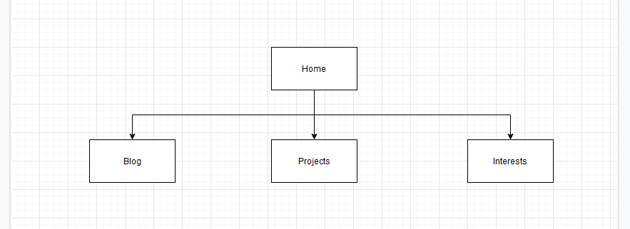

[Portfolio website](https://brians-portfolio.netlify.app/)

[GitHub repo](https://github.com/Chrystoff/portfolio2022)

Purpose:
The purpose of this website is to represent my alter ego and his abilities and experience in web development. with the ultimate goal of getting someone to hire me.

Functionality/features:
The website features synonymous elements throughout every document that I felt fit the specified use. It features images that have been uploaded and resized and utilised. Also the use of flexbox in multiple levels of deployment.

Sitemap

Screen shots:
[Home page](images/large_homepage.png), 
[Blog page](images/large_blog.png), 
[Interests Page](images/large_interests.png), 
[Projects page](images/large_projects.png).

The target audience is a business or company looking for someone to fill a web development position.

Tech Stack: HTML, CSS

